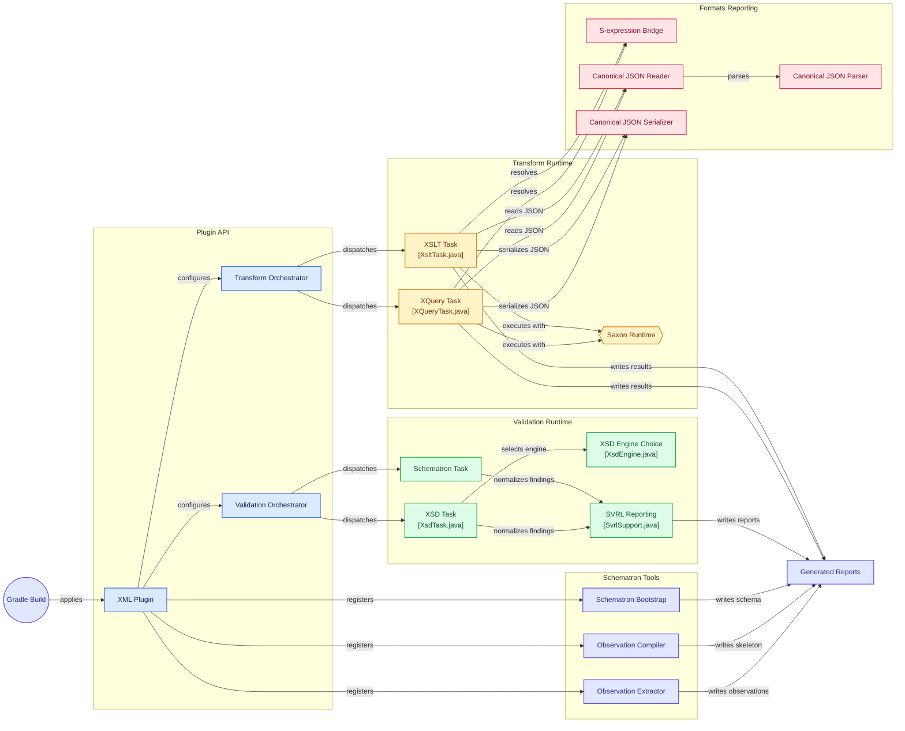

# Architecture Overview 

```mermaid
flowchart LR

subgraph group_plugin["Plugin API"]
  node_xml_plugin["XML Plugin"]
  node_transform_base["Transform Orchestrator"]
  node_validation_base["Validation Orchestrator"]
end

subgraph group_transform["Transform Runtime"]
  node_xslt_task["XSLT Task<br/>[XsltTask.java]"]
  node_xquery_task["XQuery Task<br/>[XQueryTask.java]"]
  node_saxon_runtime{{"Saxon Runtime"}}
end

subgraph group_validation["Validation Runtime"]
  node_xsd_engine["XSD Engine Choice<br/>[XsdEngine.java]"]
  node_svrl_support["SVRL Reporting<br/>[SvrlSupport.java]"]
  node_schematron_task["Schematron Task"]
  node_xsd_task["XSD Task<br/>[XsdTask.java]"]
end

subgraph group_formats["Formats Reporting"]
  node_sexpr_resolvers["S-expression Bridge"]
  node_json_parser["Canonical JSON Parser"]
  node_json_reader["Canonical JSON Reader"]
  node_json_serializer["Canonical JSON Serializer"]
end

subgraph group_schematron["Schematron Tools"]
  node_bootstrap_task["Schematron Bootstrap"]
  node_observation_compile["Observation Compiler"]
  node_observation_extract["Observation Extractor"]
end

node_gradle_build(("Gradle Build"))
node_generated_outputs["Generated Reports"]

node_gradle_build -->|"applies"| node_xml_plugin
node_xml_plugin -->|"configures"| node_transform_base
node_xml_plugin -->|"configures"| node_validation_base
node_xml_plugin -->|"registers"| node_bootstrap_task
node_xml_plugin -->|"registers"| node_observation_compile
node_xml_plugin -->|"registers"| node_observation_extract
node_transform_base -->|"dispatches"| node_xslt_task
node_transform_base -->|"dispatches"| node_xquery_task
node_xslt_task -->|"executes with"| node_saxon_runtime
node_xquery_task -->|"executes with"| node_saxon_runtime
node_xslt_task -->|"resolves"| node_sexpr_resolvers
node_xquery_task -->|"resolves"| node_sexpr_resolvers
node_xslt_task -->|"reads JSON"| node_json_reader
node_xquery_task -->|"reads JSON"| node_json_reader
node_json_reader -->|"parses"| node_json_parser
node_xslt_task -->|"serializes JSON"| node_json_serializer
node_xquery_task -->|"serializes JSON"| node_json_serializer
node_xslt_task -->|"writes results"| node_generated_outputs
node_xquery_task -->|"writes results"| node_generated_outputs
node_validation_base -->|"dispatches"| node_schematron_task
node_validation_base -->|"dispatches"| node_xsd_task
node_xsd_task -->|"selects engine"| node_xsd_engine
node_schematron_task -->|"normalizes findings"| node_svrl_support
node_xsd_task -->|"normalizes findings"| node_svrl_support
node_svrl_support -->|"writes reports"| node_generated_outputs
node_bootstrap_task -->|"writes schema"| node_generated_outputs
node_observation_compile -->|"writes skeleton"| node_generated_outputs
node_observation_extract -->|"writes observations"| node_generated_outputs

click node_xml_plugin "https://github.com/jurgenei/gradle-xml-plugin/blob/main/src/main/java/name/jurgenei/gradle/xml/XmlTransformPlugin.java"
click node_transform_base "https://github.com/jurgenei/gradle-xml-plugin/blob/main/src/main/java/name/jurgenei/gradle/xml/AbstractXmlTransformTask.java"
click node_validation_base "https://github.com/jurgenei/gradle-xml-plugin/blob/main/src/main/java/name/jurgenei/gradle/xml/AbstractXmlValidationTask.java"
click node_xslt_task "https://github.com/jurgenei/gradle-xml-plugin/blob/main/src/main/java/name/jurgenei/gradle/xml/XsltTask.java"
click node_xquery_task "https://github.com/jurgenei/gradle-xml-plugin/blob/main/src/main/java/name/jurgenei/gradle/xml/XQueryTask.java"
click node_sexpr_resolvers "https://github.com/jurgenei/gradle-xml-plugin/blob/main/src/main/java/name/jurgenei/gradle/xml/saxon/SaxonSexprResolvers.java"
click node_json_parser "https://github.com/jurgenei/gradle-xml-plugin/blob/main/src/main/java/name/jurgenei/gradle/xml/json/JsonCanonicalParser.java"
click node_json_reader "https://github.com/jurgenei/gradle-xml-plugin/blob/main/src/main/java/name/jurgenei/gradle/xml/json/JsonCanonicalXmlReader.java"
click node_json_serializer "https://github.com/jurgenei/gradle-xml-plugin/blob/main/src/main/java/name/jurgenei/gradle/xml/json/JsonCanonicalSerializer.java"
click node_xsd_engine "https://github.com/jurgenei/gradle-xml-plugin/blob/main/src/main/java/name/jurgenei/gradle/xml/validation/XsdEngine.java"
click node_svrl_support "https://github.com/jurgenei/gradle-xml-plugin/blob/main/src/main/java/name/jurgenei/gradle/xml/validation/SvrlSupport.java"
click node_schematron_task "https://github.com/jurgenei/gradle-xml-plugin/blob/main/src/main/java/name/jurgenei/gradle/xml/SchematronTask.java"
click node_xsd_task "https://github.com/jurgenei/gradle-xml-plugin/blob/main/src/main/java/name/jurgenei/gradle/xml/XsdTask.java"
click node_bootstrap_task "https://github.com/jurgenei/gradle-xml-plugin/blob/main/src/main/java/name/jurgenei/gradle/xml/SchematronBootstrapTask.java"
click node_observation_compile "https://github.com/jurgenei/gradle-xml-plugin/blob/main/src/main/java/name/jurgenei/gradle/xml/SchematronObservationCompileTask.java"
click node_observation_extract "https://github.com/jurgenei/gradle-xml-plugin/blob/main/src/main/java/name/jurgenei/gradle/xml/SchematronExtractTask.java"

classDef toneNeutral fill:#f8fafc,stroke:#334155,stroke-width:1.5px,color:#0f172a
classDef toneBlue fill:#dbeafe,stroke:#2563eb,stroke-width:1.5px,color:#172554
classDef toneAmber fill:#fef3c7,stroke:#d97706,stroke-width:1.5px,color:#78350f
classDef toneMint fill:#dcfce7,stroke:#16a34a,stroke-width:1.5px,color:#14532d
classDef toneRose fill:#ffe4e6,stroke:#e11d48,stroke-width:1.5px,color:#881337
classDef toneIndigo fill:#e0e7ff,stroke:#4f46e5,stroke-width:1.5px,color:#312e81
classDef toneTeal fill:#ccfbf1,stroke:#0f766e,stroke-width:1.5px,color:#134e4a
class node_xml_plugin,node_transform_base,node_validation_base toneBlue
class node_xslt_task,node_xquery_task,node_saxon_runtime toneAmber
class node_xsd_engine,node_svrl_support,node_schematron_task,node_xsd_task toneMint
class node_sexpr_resolvers,node_json_parser,node_json_reader,node_json_serializer toneRose
class node_bootstrap_task,node_observation_compile,node_observation_extract,node_gradle_build,node_generated_outputs toneIndigo
```